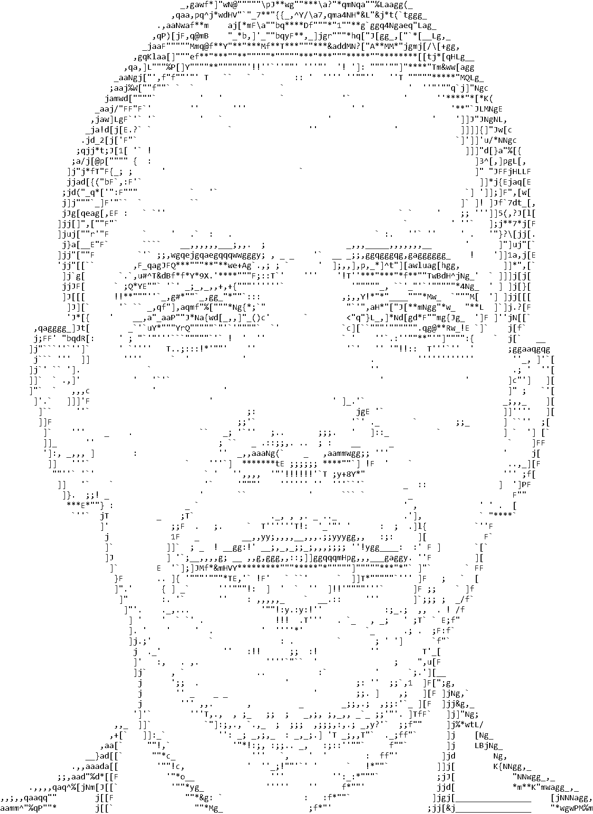
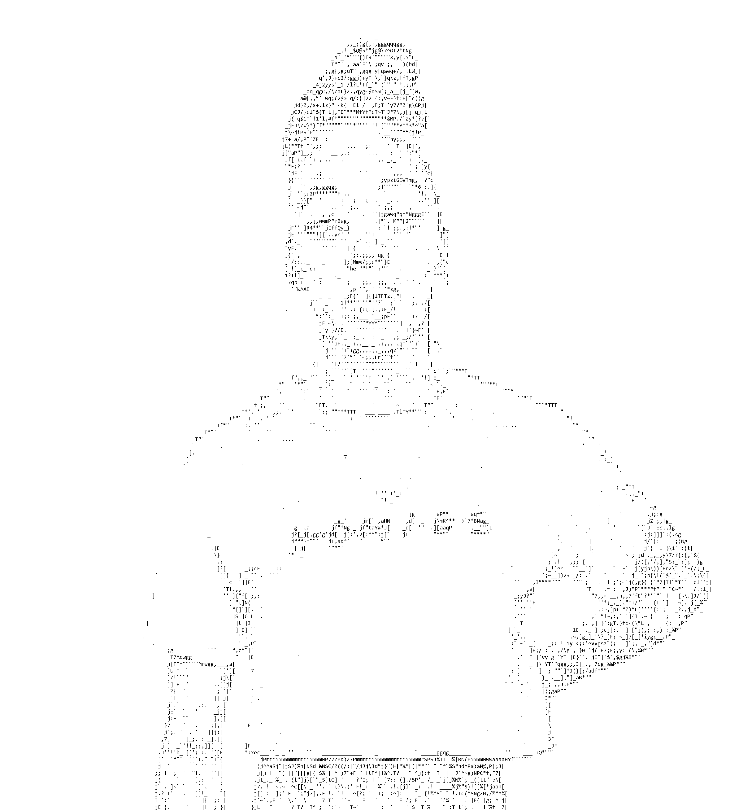

# ASCII_ART
C program to convert images and gifs into ascii art

## Accepted Input
* JPG PNG, GIF, TGA, BMP, PSD, HDR, PIC

## Currently supported Output
* .txt, .text, .jpg, .gif

## How it works
Essentially the program breaks up image into cells that will be represented by a single character. Both cells and characters are broken up into further sections. Each of these sections within the cell/character have their average brightness calculated. Then the brightness of sections are stored relative to the average brightness of the cell/character. So if the value of a section is 1.0, the brightness of that section is the same as the rest of the cell/character. Then by comparing the sections of a cell to a character, the best character to best represent the cell can be chosen.

The program essentially compares the relative change in brightness of the cell to the relative change in brightness of the character to find the best character. This means that images that hard edges turn out better. Images with busy backgrounds tend to not look as good. 

## How to Compile

#### Windows
    gcc -o runArt.exe libs/*.c src/*.h src/*.c -pthread -lcomdlg32 -lole32 -Wl,-Bstatic,--whole-archive -lwinpthread -Wl,--no-whole-archive
#### Linux

#### MacOs

## Examples

    
## How To Change Font
    
**The font must be monospaced.** 

The format of the fontInfo.h file is as follows
    
    number of characters in the font
    width in pixels of the font
    height in pixels of the font
    
    [1st character in font][width * height number of 1's or 0's, 1 represents a white pixel
    0 represents a black pixel]\n
    [2nd char][width * height 1's and 0s]\n
    .
    .
    .
    [Nth char][width * height 1's and 0s]\n
    
The current font used in the project is Consolas Regular simply because it is the default
font for windows notepad. 

Each cell of the image that will be converted into a single character is broken up into
8 sections. (2 sections wide, 4 sections tall) SEC_LEN specifies the length of each section. 
For example if SEC_LEN is 2, the section will be made up of a square of 4 pixels (since 2 
squared is 4). This mean that each cell of the image that is 4 pixels wide and 8 pixels wide
will be converted to one character.

